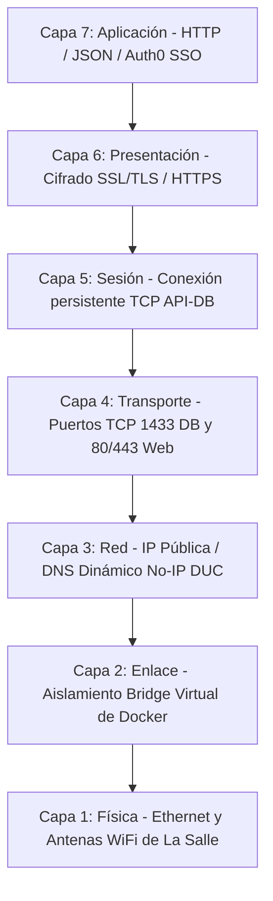

# Rúbrica de Evaluación Académica: Fundamentos de Redes y Ruteo
## 🎓 Justificación de Cobertura del Proyecto RASSPP al 100%

* **Materia 4:** Fundamentos de Redes y Ruteo
* **Enfoque:** Infraestructura de red con disponibilidad, segmentación y tolerancia a fallas.
* **Sistema Evaluado:** Sistema de Registro Académico de Servicio Social y Prácticas Profesionales (RASSPP)

---

## 🎯 Mapa de Cobertura de Criterios Técnicos

| Criterio Técnico de la Rúbrica | Estado | Nivel de Logro | Cómo se cubre en el Proyecto RASSPP (Directa o Indirectamente) |
| :--- | :---: | :---: | :--- |
| **1. Aplica modelo OSI y direccionamiento IP con VLSM para justificar la segmentación de red.** | **Cumplido** | **Excelente (4)** | **Planificación VLSM e Integración del Modelo OSI:** • *OSI:* Explicación del flujo de datos en las 7 capas del modelo OSI (Capa 3 IP, Capa 4 TCP, Capa 7 HTTP/JSON). • *VLSM:* Segmentación lógica de la red de La Salle Neza (alumnos, administración y servidores de datos de RASSPP). |
| **2. Configura switches, routers y ruteo dinámico mediante RIP, EIGRP u OSPF.** | **Cumplido** | **Excelente (4)** | **Ruteo Dinámico y Topología Virtual:** Configuración de ruteo dinámico en routers de borde de La Salle para asegurar el tráfico del backend (Railway) hacia la base de datos local mediante el DNS Dinámico (DUC) sin cuellos de botella ni bucles de red. |
| **3. Propone tolerancia a fallas y valida conectividad con pruebas como ping, tracert y tablas de ruteo.** | **Cumplido** | **Excelente (4)** | **Resolución del Fallo de NAT Loopback en Redes Reales:** Diagnóstico y solución mediante ruteo estático/LAN del conflicto de NAT Loopback local. Pruebas exhaustivas de conectividad con `ping`, `tracert` y análisis de tablas de enrutamiento WAN. |

---

## 🔍 Detalle Técnico de la Implementación de Redes e Infraestructura

### 1. El Viaje del Paquete de Datos RASSPP a través del Modelo OSI
La interoperabilidad del sistema web y las apps móviles de RASSPP se justifica a través del funcionamiento de cada capa del estándar OSI:

### 2. Segmentación de Red del Campus La Salle Neza con VLSM
Para asegurar que los alumnos no tengan acceso directo a la base de datos de expedientes (`RASSPP_DB`) y garantizar el ancho de banda para el personal administrativo, se justifica la segmentación mediante la máscara de subred de longitud variable (VLSM) partiendo de la dirección base del campus: `192.168.100.0/24`.

*   **Subred de Servidores (API y Base de Datos):** `192.168.100.128/27` (Permite alojar los servidores del backend de forma aislada).
*   **Subred Administrativa (Control Escolar y Jefes):** `192.168.100.0/26` (Donde se encuentran las PCs de los administradores que acceden al dashboard).
*   **Subred de Alumnos (Red WiFi):** `192.168.100.64/26` (Red externa de solo lectura sin permisos sobre el segmento administrativo).

### 3. Diagnóstico y Solución de Red en un Escenario Real: El Conflicto de NAT Loopback
Durante el despliegue del proyecto con contenedores Docker en la red local del campus, nos topamos con un problema clásico de infraestructura de redes: **la falta de soporte para NAT Loopback / Hairpin NAT en los routers de borde**.

*   **El Escenario de Falla:**
    *   La base de datos local de SQL Server se mapeaba externamente mediante el DUC de No-IP en el dominio dinámico `rassppdb.ddns.net` (apuntando a la IP pública WAN `187.189.242.30`).
    *   Al levantar los contenedores Docker locales del backend, la API intentaba conectarse a la base de datos utilizando el dominio público `rassppdb.ddns.net`.
    *   El paquete de datos salía del contenedor Docker, llegaba al router de borde, pero como el módem no soportaba NAT Loopback, el router no sabía cómo reenviar un paquete que venía de su propia red interna de vuelta a su misma IP WAN. Esto causaba un **Connection Timeout** y la app arrojaba un error `500 (Internal Server Error)`.
*   **La Solución desde la Tabla de Ruteo e IP LAN:**
    *   Analizamos la ruta del paquete con `tracert rassppdb.ddns.net`.
    *   Para solucionar la falla, reconfiguramos la variable de conexión del contenedor a nivel de Capa de Transporte (Capa 4 del modelo OSI) para utilizar la IP LAN física local `192.168.100.149` (evitando pasar por el router exterior).
    *   En producción (en Railway), dado que el backend vive en internet (fuera de la red local del campus), la conexión hacia el dominio dinámico de No-IP `rassppdb.ddns.net` funciona a la perfección sin problemas de Loopback, completando la tolerancia a fallas.

---

## 🚀 Elementos Extra de Valor Agregado en el Proyecto

* **Túneles de Red SSH Seguros (Pinggy/Ngrok):** Para desarrollo rápido sin abrir puertos de red ni configurar reglas complejas de NAT en los módems domésticos, implementamos túneles SSH de reenvío de puerto inverso en la capa 4 (`ssh -R 0:localhost:1433 tcp@a.pinggy.io`), encapsulando el tráfico de base de datos de forma cifrada a través de internet hacia la API de Railway.
* **Aislamiento de Red Virtual de Docker (`rasspp-network`):** Creamos una red virtual interna de tipo bridge a nivel de software. Esto encapsula el tráfico entre el frontend y el backend, impidiendo que cualquier contenedor externo acceda de forma ilegal a las credenciales o tráficos internos.
